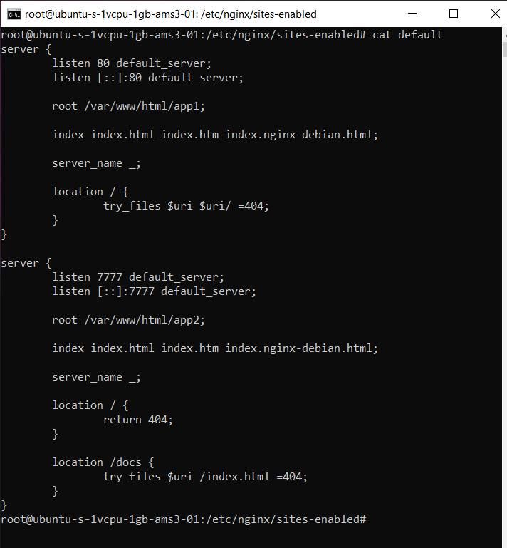

# Nginx
# Задание

Порядок выполнения:
Анализ задачи.
Исследование источников.
Реализация двух приложений с использованием html.
Конфигурирование NGINX.

# Выполнение задания

1. http://167.172.33.80:7777/docs
2. http://167.172.33.80

#Работает)

